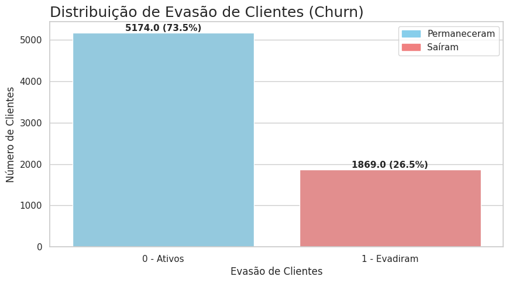
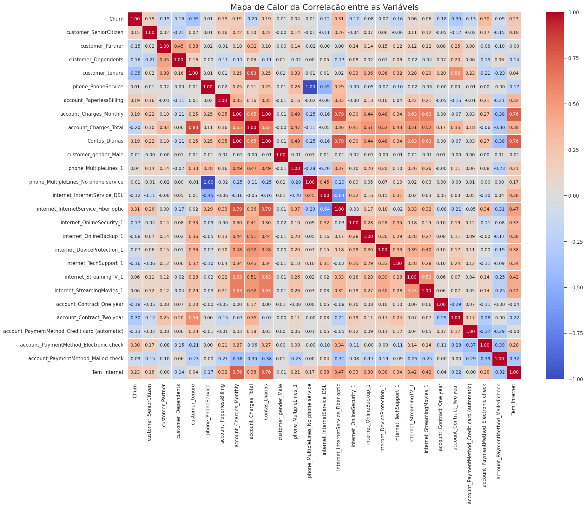
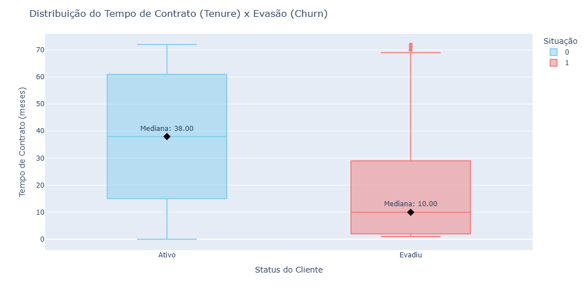
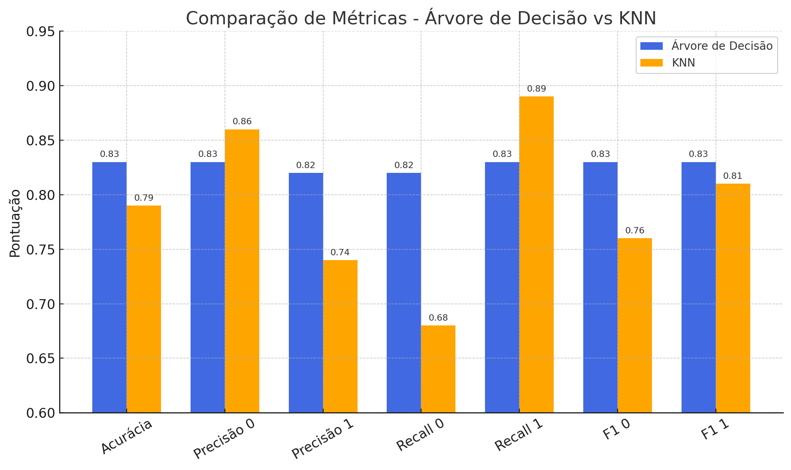

# 📊 Análise de Evasão de Clientes – TelecomX

<h2> 📋 Sobre o Projeto </h2>
O objetivo deste projeto é analisar os dados de uma empresa fictícia do setor de telecomunicações para entender os fatores que mais influenciam a evasão de clientes (**Churn**) e propor estratégias de retenção com base nos resultados.

A análise utiliza bibliotecas do ecossistema Python para ciência de dados, incluindo **Pandas**, **Matplotlib**, **Seaborn** e modelos de Machine Learning como **KNN** e **Árvore de Decisão**.

---

<h2> 🛠️ Ferramentas Utilizadas </h2>

- Python 3
- Pandas
- Matplotlib
- Seaborn
- Scikit-learn
- Jupyter Notebook / Google Colab

---

<h2> 📂 Estrutura da Base de Dados </h2>

O dataset contém informações sobre clientes, incluindo:
- Dados demográficos
- Tipo de contrato e serviços contratados
- Valores cobrados e totais pagos
- Informações sobre cancelamento (Churn)

---

<h2> 🧹 Preparação dos Dados </h2>

1. **Codificação de variáveis categóricas**
2. **Balanceamento das classes (Churn)**
3. **Separação em variáveis preditoras (X) e alvo (y)**

---

<h2> 📊 Análise Exploratória de Dados </h2>

A análise buscou entender como diferentes variáveis influenciam a evasão, com destaque para:
- Tipo de contrato
- Tempo de permanência
- Valor mensal pago
- Quantidade de serviços contratados
- Método de pagamento

<h3> Distribuição de Evasão </h3>

<h3> Correlação entre Variáveis Numéricas </h3>

<h3> Evasão por Tipo de Contrato </h3>

---

<h2> 🤖 Modelos de Machine Learning </h2>

Foram utilizados e comparados dois modelos:
- **KNN (K-Nearest Neighbors)**
- **Árvore de Decisão**

Ambos foram treinados com dados balanceados para melhorar a capacidade preditiva separados em treino, teste e validação.

<h3> Métricas Avaliadas </h3>
- Acurácia
- Precisão
- Recall
- F1-Score
- Matriz de Confusão

---

<h2> 📈 Comparação de Desempenho </h2>

- Árvore de Decisão teve melhor acurácia (0,83) e desempenho equilibrado entre as classes.
- KNN foi melhor para identificar clientes que irão cancelar (classe 1), mas errou mais na classe 0.
- Para equilíbrio geral, escolha a Árvore de Decisão.
- Para priorizar detecção de churn, mesmo com mais erros, use o KNN.
---

<h2> 🔍 Principais Fatores que Influenciam a Evasão </h2>

Com base na análise e importância das variáveis:
1. Tipo de contrato (mensal tem maior evasão)
2. Tempo de permanência
3. Valor mensal pago
4. Método de pagamento
5. Quantidade de serviços adicionais

---

<h2> 💡 Estratégias de Retenção </h2>

- Estratégia 1: Foco em Clientes Novos
- Estratégia 2: Campanhas de Fidelização de Contratos
- Estratégia 3: Melhoria na Qualidade de Serviços de Internet
- Estratégia 4: Promoção de Serviços Agregados

---

<h2> 📌 Conclusão </h2>

O projeto mostrou que a evasão de clientes está fortemente relacionada ao tipo de contrato e ao valor mensal pago.  
A aplicação de modelos preditivos pode ajudar a identificar clientes com maior probabilidade de cancelar, permitindo ações proativas para reter a base.

---

